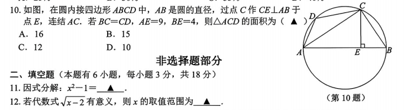
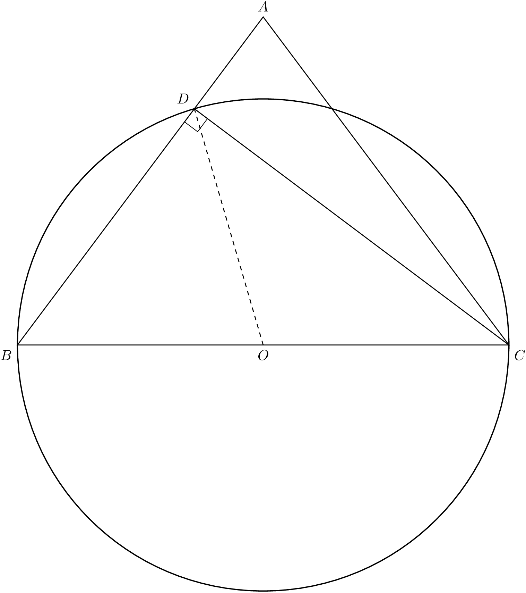
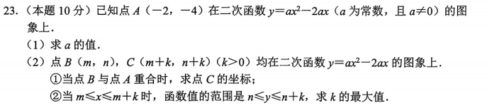
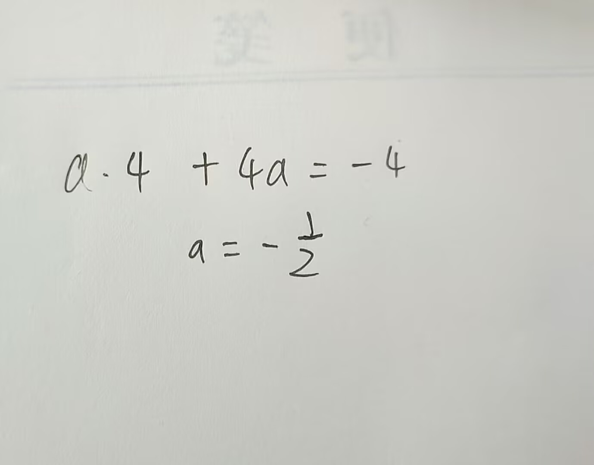
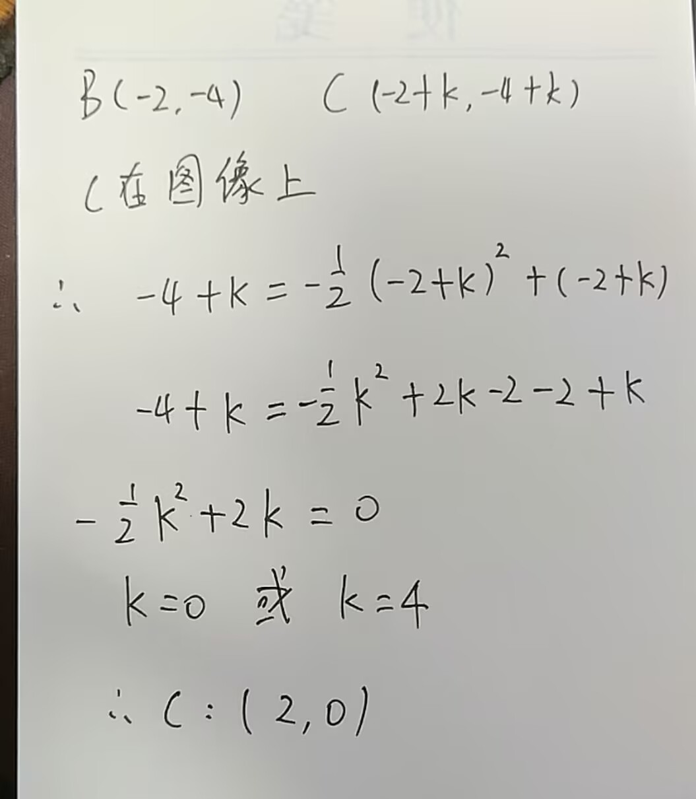
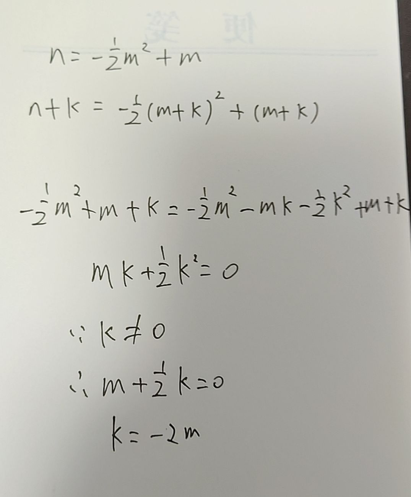
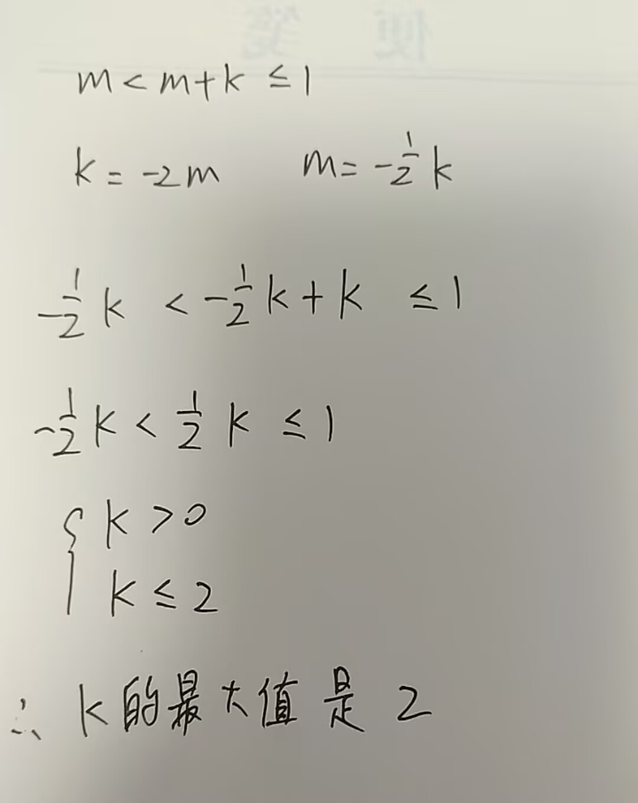

# 星学伴 AI 教师 · 对话示例

五个真实对话案例，展示从「拍题上传」到「完整教学闭环」的全链路，含 L3/L4 防线实战。

## 教学流水线

```
📷 拍照上传 → 🔍 Vision 识别 → 🧮 solve_problem（后台异步 L3 多路径求解）
  → 🤔 苏格拉底引导 → ✍️ 手写步骤识别 → 📊 evaluate_answer（三维度评估）
  → 🔁 循环引导 / 🔓 提示模式（3 次卡住自动切换）
  → ✅ 确认掌握 → 📝 generate_question（变式题）→ 📐 generate_figure（TikZ 配图）
  → 🛡️ 全程 L3 解答正确性 + L4 行为管控护航
```

## 核心设计

| 特性 | 说明 |
|------|------|
| 先解题再引导 | 教师收到题目后后台异步求解，不让学干等；答案就绪后基于正确结果引导 |
| 苏格拉底提问 | 反问 / 拆解 / 类比引导学生自己思考，不直接给答案 |
| 手写识别 | Vision 双场景识别：拍题目 / 拍手写过程，自动分流处理 |
| 三维度评估 | 思路正确性 + 结果正确性 + 表述完整性 |
| 自适应难度 | IRT 知识追踪根据历史表现动态调整出题难度 |
| 提示模式 | 连续 3 次卡住 → 自动切换，给出关键线索 |
| **L3 解答正确性** | 多路径求解 + 答案验证 + 自疑纠错，杜绝"教师自己算错" |
| **L4 行为管控** | 内容分类 + 会话锁定 + 日锁禁言，防滥用防恶意 |

---

## 案例 1：代数应用题
*34 条消息 · 全程苏格拉底引导 · 百钱百鸡变式*

> 学生发来一道古代数学名著《张丘建算经》中的"百钱百鸡"变式题——列方程组。从「完全不会」到「自己一步步化简出方程组」，34 轮对话全程零直接给答案。中间两次"我不会"也没让教师破防，坚持拆解引导。

### 第 1 轮 · 学生发题
> 老师，这道题我不会：8.《张丘建算经》……用五十六钱买鸡三十只，且鸡翁的数量比鸡母多两只。问鸡翁、鸡母、鸡雏各几只？设鸡母 x 只，鸡雏 y 只……

**🤖 教师**：这道题你目前有什么思路吗？题目里说设了鸡母 x 只、鸡雏 y 只——**鸡翁的数量怎么用 x 或 y 表示？**

### 第 2 轮 · 学生
> 应该是 30-x-y

**🤖 教师**：很好！方向对的 👍 那接下来两个条件：① 总钱数五十六钱——列方程；② 鸡翁比鸡母多两只——怎么用 x 和 y 表示？

### 第 3-5 轮 · 连续卡住
> 我不会 → 教师拆解引导 → 学生尝试列式但有小错 → 教师逐项纠正

### 第 6-14 轮 · 逐步推进
> 学生一步步展开括号、合并同类项、移项——每次只给一步提示，学生自己完成计算。鸡雏「每三只值一钱」→ 1/3 的陷阱也被学生自己跨过去了。

### 第 15 轮 · 突破
> 好的，这题我会做了

**🤖 教师**：太好了！你自己一步步把方程列出来并化简了 🎉 要不要试试一道变式题巩固一下？

### 第 16 轮 · 变式题
> 学生：我准备好了

**🤖 教师** → `generate_question`：生成一道植树问题的二元一次方程组应用题，学生继续练习。

---

## 案例 2：几何题
*32 条消息 · 全流程：📷 拍照 → 🔍 识别 → 🧮 求解 → 🤔 引导 → 📝 出题 → 📐 TikZ 配图*

> 学生拍照上传一道圆内接四边形几何题。Vision 正确识别全部选项，Teacher 用纯几何方法（射影定理→圆周角→角平分线→全等三角形）完成苏格拉底引导。答对后出变式题 + 自动生成 TikZ 配图。

### 第 1 轮 · 📷 学生上传图片



> 📷 **Vision 识别**：圆内接四边形 ABCD，AB 为直径，CE⊥AB，BC=CD，AE=9，BE=4。选择题，四个选项全部正确识别。

**🤖 教师** → `solve_problem`：内部求解得 B. 15。开场引导："这道题你目前有什么思路？卡在哪里了？"

### 第 2-8 轮 · 纯几何推理链
> 学生：射影定理 → CE=6
> 教师：BC=CD 在圆中意味着什么？
> 学生：相等弦→相等圆周角，AC 平分 ∠BAD
> 教师：角平分线有什么性质？
> 学生：角平分线上点到角两边距离相等 → CF=CE=6
> 教师：圆内接四边形外角等于内对角 → △CDF∽△CBE
> 学生：不仅相似，还全等！DF=BE=4

### 第 9 轮 · 掌握
> 这题我会了 → ✅ 确认 → 出变式题

**🤖 教师** → `generate_question` + `generate_figure`：生成一道等腰三角形 + 圆的综合题，TikZ 自动渲染配图 👇



---

## 案例 3：手写解题过程识别 ✍️
*29 条消息 · Vision 双场景：拍题目 + 4 张手写步骤依次识别*

> 学生拍一道二次函数综合题（10 分大题），然后每做完一步就拍照上传手写过程。Vision 自动识别为「手写内容」并分流处理——不触发重新求解，而是直接评估学生的手写步骤。

### 📷 第 1 轮 · 学生拍题上传



> 📷 **Vision 识别**：二次函数 y=ax²-2ax，点 A(-2,-4)，三小问。知识点：二次函数的图像与性质。

**🤖 教师** → `solve_problem` 后台异步求解 → **不等结果，先和学生互动**：
"这道题是二次函数的综合题，先看第（1）问——已知点 A 在函数图象上，你打算怎么求 a？说说你的思路。"

> 🧮 后台：L3 多路径求解中（DeepSeek 双路径 → 分叉 → 重试 → Qwen 仲裁，~10 秒后答案就绪）

### ✍️ 第 2 轮 · 学生上传手写步骤 1



> 📷 **Vision 识别**：a·4 + 4a = -4，a = -1/2。识别为手写解题步骤，内容清晰无误。

**🤖 教师** → `evaluate_answer`：✅ 已掌握。a 算对了，代入点坐标的方法没问题。"很好！第（1）问你做对了。接下来看第（2）问①——B 与 A 重合时，B 的坐标是什么？C 的坐标呢？"

### ✍️ 第 3 轮 · 手写步骤 2



> 📷 **Vision 识别**：B(-2,-4)，C(-2+k, -4+k)，代入抛物线方程，展开得 -½k²+2k=0，k=0 或 k=4。

**🤖 教师** → `evaluate_answer`：思路正确，k=0 舍去（k>0），C(2,0)。"你列式和展开都很好！注意 k=0 要舍去哦，因为题目说了 k>0。那 k=4 时 C 的坐标是多少？"

### ✍️ 第 4 轮 · 手写步骤 3



> 学生继续推进第（2）问②，尝试求 k 的最大值。

### ✍️ 第 5 轮 · 手写步骤 4



> 学生独立完成最后一步，得出 k 的最大值。

**🤖 教师**：全题评判——三小问全部正确 ✅ 要不要来一道类似的二次函数变式题巩固？

> 🎯 **设计亮点**：学生每步手写都即时获得反馈，不需要等全部做完才检查。Vision 能区分「拍题目」和「拍手写」——前者触发求解+引导，后者直接评估，不会反复求解同一道题。

---

## 案例 4：L3 自疑 → L4 锁定 🔒
*16 条消息 · 学生连续 3 次给出相同错误答案 → 自动触发 Harness 四级防线*

> 学生上传二元一次方程组题目后，反复给出错误答案 `x=y=1`。第一轮正常引导纠正；第二轮 L3 检测到同一错误重复出现，触发「自疑机制」——后台异步重算验证答案正确性；第三轮 L3 确认学生持续错误，立即上报 L4，会话锁定并标记「需人工介入」。全程自动化，教师零感知。

### 第 1 轮 · 📷 学生拍题上传

> 18.（本题8分）解方程组：\\(\\begin{cases} 3x - 2y = 5, \\\\ x - y = -1. \\end{cases}\\)（知识点：二元一次方程组的解法）

**🤖 教师** → solve_problem 后台求解 → 不等结果，先引导：「这道题你打算怎么入手？有什么思路吗？」

> 🧮 后台：L3 双路径一致 ✓，正确答案 x=7, y=8

### 第 2 轮 · 学生第 1 次给出 `x=y=1`

> 👤 学生：x=y=1

**⚙️ 系统** → 🔍 L3 程序化评估：未掌握（代回第二个方程 1-1=0≠-1）

**🤖 教师**：方向对，但代入检查一下——1-1=0，不等于-1。看第二个方程 x-y=-1，能把 x 表示出来吗？

### 第 3 轮 · 学生第 2 次给出 `x=y=1` 🔥

> 👤 学生：x=y=1（再次给出相同错误）

**⚙️ 系统** → 📝 L3 追踪：「x=y=1」同错 ×2 → 🔥 **L3-1 自疑触发！** 后台异步重算

> 🧮 重新多路径求解 → 双路径一致 ✓ → 确认 x=7, y=8 无误，答案未变

**🤖 教师**：没关系，看第二个方程——把 -y 移过去会变成什么？

### 第 4 轮 · 学生第 3 次给出 `x=y=1` 🚨

> 👤 学生：x=y=1（第三次！）

**⚙️ 系统** → 📝 L3 追踪：「x=y=1」同错 ×3 → 🚨 **L3 上报 L4！**

```
🔒 L4 锁定 [L3→L4]（日锁 1/3）
   原因：学习异常——学生重复错误≥3次
   动作：会话锁定 + 标记需人工介入 + 推送任课老师
```

**🤖 教师**（提示模式）：给你一个提示——从 x-y=-1 得 x=y-1，代入第一个方程试试看？

> 🎯 **设计亮点**：
> - **L3 程序化评估**：不再等 LLM 决定，系统代码层直接调 evaluate_answer，100% 不遗漏
> - **L3-1 自疑**：同一错误第 2 次出现时，后台异步重算——用多路径求解 + 双模型仲裁确认教师答案无误
> - **L3→L4 上报**：第 3 次同错 → 判定学习异常而非教学问题 → 自动锁定，推送人工
> - **日锁禁言**：同一会话日锁 ≥3 次 → 全天禁言，防止恶意刷屏
> - 整个过程教师端无需任何操作，Harness 四级防线全自动运转

---

## 案例 5：非学习内容拦截 🛡️
*4 条消息 · L4 内容分类 → 1 次提醒 → 2 次锁定*

> 学生进来说"你是谁""我想打篮球"，系统判定为非学习内容。第 1 次温和提醒，第 2 次立即锁定会话。锁定后再发消息，回复与锁定那一刻完全一致——不透露锁定原因，不给学生试探空间。

### 第 1 轮 · 试探

> 👤 学生：你是谁

**⚙️ 系统** → ⚠️ L4 非学习内容（第 1 次）→ 放行提醒

**🤖 教师**：🐧 我是数学学习助手哦～只聊数学题、解题思路、知识点这些。有不会的题目发给我，我教你！

### 第 2 轮 · 锁死 🔒

> 👤 学生：我想打篮球

**⚙️ 系统** → ⚠️ L4 非学习内容（第 2 次）→ 🔒 **L4 锁定！**

**🤖 教师**：🔒 本次会话已被锁定，无法继续对话。请明天再来学习数学吧 🐧

### 第 3 轮 · 锁后试探

> 👤 学生：我明天不想学数学

**⚙️ 系统** → 🔒 会话已锁定 → 复用锁定消息

**🤖 教师**：🔒 本次会话已被锁定，无法继续对话。请明天再来学习数学吧 🐧（完全一致）

> 🎯 **设计亮点**：
> - **内容分类前置**：L4 门禁在 Teacher LLM 调用前拦截，不浪费 token
> - **渐进式响应**：1 次提醒引导，2 次果断锁定，不拖泥带水
> - **锁定后话语统一**：锁后所有回复与锁定时完全一致，不给学生任何交互信号
> - **日锁禁言**：当天跨会话累计 ≥3 次锁定 → 全天禁言
> - **消息可追溯**：即使被拦截的消息也写入 session JSON，便于排查

---
